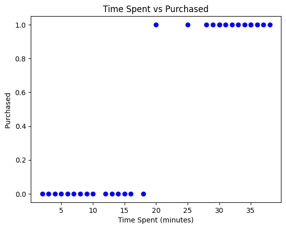
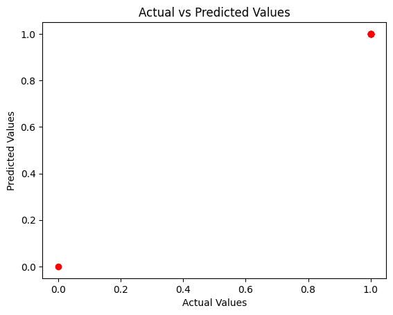

# 🛒 E-Commerce Purchase Prediction using Logistic Regression

## 📌 Problem Statement
In an e-commerce company, the management wants to predict whether a customer will purchase a high-value product based on their age, time spent on the website, and whether they have added items to their cart. The goal is to optimize marketing strategies by targeting potential customers more effectively, thereby increasing sales and revenue.

---

## 📌 Project Overview
This project uses Logistic Regression to predict whether a customer is likely to make a purchase based on behavioral and demographic features.

---

## 📊 Dataset Features
- Age
- Time_Spent
- Added_to_Cart

## 🎯 Target Variable
- Purchase

---

## ⚙️ Technologies Used
- Python
- NumPy
- Pandas
- Matplotlib
- Scikit-learn

---

## 🤖 Model Used
- Logistic Regression

---

## 🚀 Steps Performed

1. Imported required libraries and Logistic Regression model  
2. Loaded the e-commerce dataset  
3. Understood the dataset using head(), info(), and describe()  
4. Checked missing values and duplicate rows  
5. Split the dataset into input features and target variable  
6. Visualized the relationship between Time Spent and Purchase  
7. Performed train-test split  
8. Initialized the Logistic Regression model  
9. Trained the model using training data  
10. Made predictions on the test dataset  
11. Visualized Actual vs Predicted values  
12. Accepted user input for Age, Time Spent, and Added to Cart  
13. Predicted customer purchase behavior based on user input  
14. Displayed the final prediction result

---

## 📈 Visualizations

### Time Spent vs Purchase

### Actual vs Predicted

---

## 📌 Conclusion
The Logistic Regression model successfully predicts whether a customer is likely to purchase based on age, website engagement, and cart activity.

---

## 💡 Business Impact
- Helps identify high-potential customers
- Improves marketing targeting
- Supports better sales conversion strategies