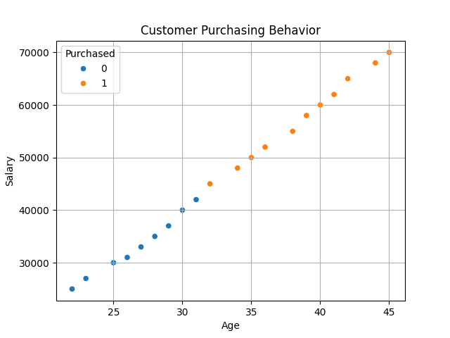

# 🛒 Customer Purchase Prediction using KNN

## 🎯 Problem Statement
A retail company wants to predict customer purchasing behavior based on their age, salary, and past purchase history.  
The goal is to classify customers into potential buying groups to personalize marketing strategies and increase sales and customer satisfaction.

---

## 📌 Project Overview
This project uses the K-Nearest Neighbors (KNN) algorithm to predict whether a customer will purchase a product or not based on their demographic and behavioral data.

---

## 📊 Dataset Features
- Age
- Salary
- Past_Purchase

## 🎯 Target Variable
- Purchased (0 = No, 1 = Yes)

---

## ⚙️ Technologies Used
- Python
- NumPy
- Pandas
- Matplotlib
- Seaborn
- Scikit-learn

---

## 🤖 Model Used
- K-Nearest Neighbors (KNN)

---

## 🚀 Steps Performed

1. Imported required libraries and KNN model  
2. Loaded the dataset using Pandas  
3. Explored dataset using `head()`, `info()`, and `describe()`  
4. Checked missing values and duplicate rows  
5. Split dataset into input features (Age, Salary) and target (Purchased)  
6. Visualized customer behavior using scatter plot  
7. Performed train-test split (80% training, 20% testing)  
8. Applied feature scaling using StandardScaler  
9. Initialized KNN model with K=5  
10. Trained the model using training data  
11. Made predictions on test dataset  
12. Evaluated model using accuracy and confusion matrix  
13. Accepted user input (Age, Salary)  
14. Applied scaling to user input  
15. Predicted customer purchase behavior  
16. Displayed final result (Target / Not Target customer)

---

## 📈 Visualization

### Customer Purchasing Behavior
Scatter plot showing Age vs Salary colored by purchase decision.

---

## 📊 Model Performance

- Accuracy: **75%**

---

## ⚠️ Warnings Observed

- DataConversionWarning:
  - Occurred because target variable was 2D
  - Fixed using: `y = df['Purchased']`

- Feature Name Warning:
  - Occurred during user input scaling
  - Can be ignored or improved using DataFrame input

---

## 📌 Conclusion

The KNN model successfully predicts customer purchasing behavior based on Age and Salary.  
It helps businesses identify potential customers and improve marketing strategies.

---

## 💡 Business Impact

- Identifies target customers  
- Improves marketing efficiency  
- Increases sales conversion  
- Helps in customer segmentation  

---

## 🧑‍💻 Author
**Sagar Wagh**
